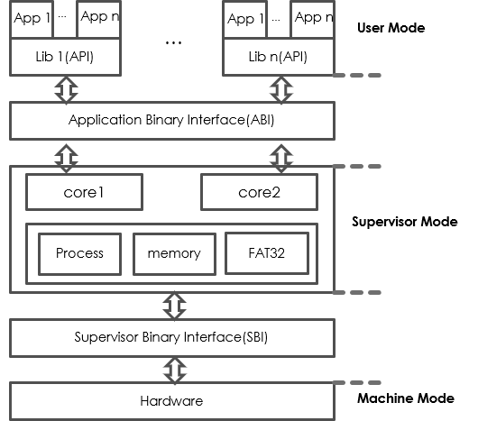
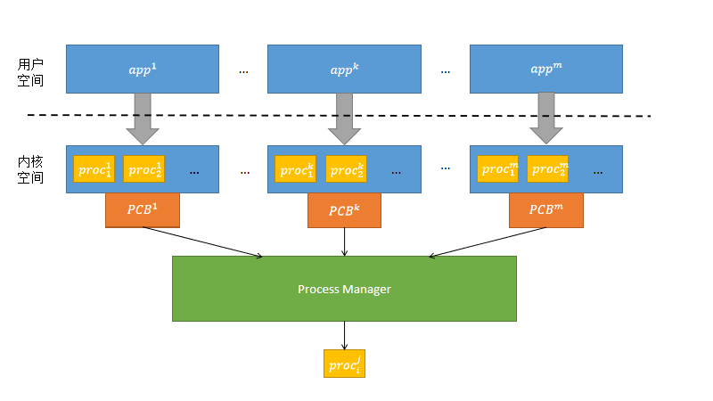

# Toyos

> Warning: This page is translated by MACHINE, which may lead to POOR QUALITY or INCORRECT INFORMATION, please read with CAUTION!


#### Introduce
Based on the RISCV system architecture, the operating system kernel that can run on the K210 development board``Toyos``And provide some system calls that can be used. Up to now, TOYOS has achieved some key features of the operating system, supports basic functions such as multi -core process management, memory management, and file systems, and has implemented some system calls accordingly. run.

- [English Version](pic/README_CN.md)

#### Software architecture

1. Directory tree:

```

|--bootloader
|    |--rustsbi-k210.bin 用于k210开发板
|    |--rustsbi-qemu.bin 用于qemu模拟器
|--toyos
|    |--src
|    |    |--trap trap管理实现
|    |    |--task 进程管理实现
|    |    |--syscall 系统调用部分实现
|    |    |--sync 可用于放互斥锁等实现文件，目前只有用聊
|    |    |--memory 内存管理实现
|    |    |--timer.rs 计数器包装、时钟中断等实现
|    |    |--sbi.rs 封装与Rustsbi的交互
|    |    |--loader 加载用户程序数据
|    |    |--linker.ld 链接文件
|    |    |--entry.asm 内核入口
|    |    |--console.rs 目前为控制台println等函数实现   
|    |--target
|    |--.cargo 
|    |--build.rs 
|    |--Makefile
|--user
|    |--src
|    |    |--bin 用户程序
|    |    |--console.rs println等函数实现
|    |    |--linker.ld 用户程序链接器
|    |    |--syscall.rs 系统调用封装
|    |    |--lang_items.rs
|    |    |--lib.rs
|    |--target 
|    |--Makefile

```
#### Installation tutorial

1. RUST development environment configuration:

1) First install the Rust version manager Rustup and Rust package manager Cargo:
curl https://sh.rustup.rs -ssf|SH
If the network speed is slow, you can modify the mirror address of Rustup to accelerate:
export rustup_dist_server = https://mirrs.ustc.edu.cn/rust-Static
export rustup_update_root = https://mirrrs.ustc.edu.cn/rust-stative/rustup
curl https://sh.rustup.rs -ssf|SH
    
2) After the installation is completed, re -open the terminal to make the environment variable take effect
    
3) Enter Rustc -Version to confirm whether to install the Rust tool chain correctly. Note: You can only use Rustc's Nightly version
If Rustc has been installed and non -Nightly version, you can use the following command to install the Nightly version
Rustup Install Nightly
Rustup Default Nightly
    
 **Intersection Intersection Intersection Note: Because some versions of Rustc's Nightly cannot use LLVM-Asm macro, it is recommended to use version 1.59.0!** 
 **Intersection Intersection Intersection Note: Because some versions of Rustc's Nightly cannot use LLVM-Asm macro, it is recommended to use version 1.59.0!** 
 **Intersection Intersection Intersection Note: Because some versions of Rustc's Nightly cannot use LLVM-Asm macro, it is recommended to use version 1.59.0!** 

4) If the network speed is relatively slow, it is best to replace the software packaging mirror image address of the software package manager Cargo.
Open or build a new ~/.cargo/config file, and modify the content:
[Source.crates-IO]
Registry ="https://github.com/rust-lang/crates.io-index" 
replace-all = 'USSTC'
[Source.ustc]
Registry ="git://mirrors.ustc.edu.cn/crates.io-index" 
    
5) Install RUST related software packages:
Rustup Target Add Riscv64GC-UNKNOWN-NONE-In
Cargo Install Cargo-Binutils-Vers = 0.3.3
Rustup Component Add LLVM-Tools-Preview
Rustup Component Add Rust-SRC

2. Install the QEMU simulator:

1) The dependent package required for installation:
SUDO APT Install AutoConf Automake AutoTools-Dev Curl Libmpc-DEV Libmpr-DEV Libgmp-DEV \ \ \
GAWK Build-ESSENTIAL BISON FLEX TEXINFO GPERF LIBTOOL PATCHUTILS BC \
zlib1g-dev libexpat-dev PKG-config libglib2.0-dev libpixman-dev git Tmux Python3-PIP

2) Compile and install and configure RISC-V support:
CD QEMU-5.0.0
./configure-Target-List = RISCV64-SOFTMMU, RISCV64-LINUX-User
Make -J $ (NPROC)

Note that the above dependency package may not be complete, such as on Ubuntu 18.04:
When error: pkg-config binary 'pkg-config' not found, you can install the PKG-config package;
When error: Glib-2.48 Gthread-2.0 is required to compile qemu, you can install the libglib2.0-dev package;
When Error: pixman> = 0.21.8 not present, you can install libpixman-dev package

3. Edit ~/.bashrc file, add a few lines to the end of the file:

export path = $ Path: /home/shinbokuow/downloads/built/qemu-5.0.0
export path = $ Path: /home/shinbokuow/downloads/built/qemu-5.0.0/riscv64-sOFTMMMU
export path = $ Path: /home/shinbokuow/downloads/built/qemu-5.0.0/riscv64-linux- userr

Then call the command: source ~/.bashrc to update the system path

4. In order to run the kernel in the K210 real machine, you need to install the Python -based serial communication library and simple serial port terminal:

PIP3 Install pyserial
SUDO APT Install Python3-Serial


#### Instruction

1. Run Toyos:

Enter the Toyos directory in the terminal, enter the instruction Make Run running code

2. There are currently four parts::

1) Bootloader: guide program, use Rustbin

2) Toyos: kernel part
The kernel code within SRC, see the code in the code for details

3) User: User testing program, temporarily use this file to test the program before the file system is implemented
The related code in SRC, including link files and related test programs, is a test program in SRC/BIN

4) Tools: including file system burning and other tools

3. Open interface to declare or annotation in the MOD.RS file in the kernel folders

# System design

## System overall architecture design

  

TOYOS follows the idea of ​​modular design, and divides the construction of the operating system based on the privilege level of the RISC-V structure into three levels: the machine layer, the operating system layer, and the user layer. The corresponding program execution permissions are also distributed from high to low.
- The user layer runs in the user mode and is located in the virtual address space. It interacts with the kernel through the system calling interface; when the user needs to perform system calls, it needs to be caught through the core through ECALL. In order to facilitate the interaction between users and the kernel, system calls are often packed and partially prepared on the user layer to form a user standard library LIB. For different languages, you can have different standard libraries.
- The operating system layer is running in the regulator mode, which is also located in the virtual address space. The physical memory is managed by a constant mapping method. Can manage some special registers. The dual -core design was adopted in the Toyos, which encapsulated the two cores. The two cores run different processes at the same time, but interact with the same kernel and run the same memory management, process management, and file system management.
    -Memory management is mainly responsible for managing the mapping relationship between the virtual address space of the user and the physical memory space, including the allocation and recycling of physical pages, the conversion of the virtual and real page, and the allocation of stacks.
    - 进程模块负责进程的资源管理,对进程进行调度等.
    - 文件系统采用FAT32结构,主要对磁盘进行读取和修改,并将读取的数据抽象化为文件,方便内核管理. 
    
    
  
As the middle layer, the core needs to provide user service abstraction to the user layer, and provide the upper layer to provide a system call interface through the interrupt service mechanism; to meet the standard of the machine layer downward, interact with the hardware through the SBI packaging interface.
- The SBI runs in the machine mode and the packaging hardware function, providing an abstract interface for the operating system layer, so that the operating system can not need to care too much about the details of the hardware. It has better compatibility and logic.

## System framework
- Process module
  - 进程号的分配与回收,进程号决定内核栈的位置
  - 处理器核心的上下文管理
  - 进程上下文管理
  - 进程资源管理
  - 进程调度管理
- Memory module
  - 内核的动态内存分配
  - 内存管理器,负责管理进程的虚拟地址空间
  - 页表机制实现,包括虚实地址转换,页表项读取,映射以及权限控制等功能. 
  - 物理页帧管理,负责页帧的分配与回收
  - 用于多线程时的内核栈分配,目前暂未使用
- File system module
  -Disk block cache implementation
  - IO设备管理
  - FAT32磁盘数据结构组织,封装和操作
  - 文件系统管理
  - 内核抽象文件系统的实现与管理
  - 并发访问与控制

# Sub -module design
## Process management

In the process management section, it is necessary to consider the creation and initialization of the process, the parent -child relationship of the process, the switching of the process, the distribution and recycling of process resources. A process urgently needs to consider the implementation of user space, and also needs to be implemented in the core space, which also increases the complexity of its realization. In our design process, a tree structure can be formed between all processes. The root node of the tree is an initial process, and the remaining processes are created on the basis of it. For process management, how to effectively maintain the process tree. In order to achieve a good abstraction and management of the process tree, we divided it into three modules, namely the process control module, the process scheduling module, and the process switching module.


### Call relationship

The execution process of one process can be divided into two parts, one is executed in the user space, and the other part is executed in the kernel space. Feeling that I am continuously executed and occupy all system resources and time. In our implementation, the calling relationship of the process execution is as shown below:

  

Each execution application will be divided into different task blocks in the kernel space. When all the task blocks of an application are executed, the application is completed. At the same time Information. The task blocks in different applications are managed by a unified process manager. It is determined that which task block should be performed at different times. When a task block is executed or exited due to abnormality, it will also be assigned to the next one The task block is performed.

### Module description

- **Process control module** 

The main function is to maintain the information of this process to control the process. It is the core module for process management. This information includes process identification, process status, address space information, and father -son processes. This information represents the core attributes in a process. When the state of the process changes, the corresponding is to maintain the control attribute content of the corresponding process. Implementation of the attributes.

- **Process scheduling module** 

It is to manage all the processes currently in the process queue with a certain scheduling strategy. The tools used for management can be called a scheduling, and the main function provided is to take a task from the queue and add a new task. Among them, a set of process queues in memory can be maintained. When a new process is created, the attribute information of the new process should be added to the queue. If the process is over or abnormally exit, it should cause the content in the process to delete from the queue. But when other tasks are involved, the task should always be in the queue.

- **Process switching module** 

Used to save the control block information of the current execution process, and the task of control flow. Its main function is to obtain the information of the current execution process and switch different processes according to the scheduling result. Its core effect can be used to obtain the processing process being performed by the processor, and when the task is switched, it can also switch between the process through the context of the current process control flow. Therefore, it will be closely related to the process scheduling module. When the process is scheduled, it means that the process should be switched, so the distribution of the process controller and the switching of different contexts.

## Memory management
Memory management mainly includes three parts: kernel space management, user space management, and page address conversion. The management of memory space is completed in the kernel virtual address space. The kernel space is managed by mapping the physical address space by pages such as pages as the unit, and the physical address space is managed. The user space and kernel space are all completed in the kernel space in the distribution of physical memory and the conversion of the page table address. At the same time, in the kernel space, it is also responsible for managing the page frame allocation and recycling of the user and the kernel on the pages of the physical memory, the page table mapping of the virtual address to the physical address, the distribution of the user stack, the file and device mapping, and the dynamic memory allocation during program operation.
The layout of the current kernel address space and the user address space and the mapping relationship between them and the physical address are shown in the figure below:

  

The kernel address space is combined with constant mapping and random mapping.`0x8000000~0x80800000` the address section adopts constant mapping to make the kernel constant memory, while facilitating the management of physical memory.`MMIO` some also use Hengfu mapping. exist `0x80800000` the above addresses are randomly mapped, which are mainly used for the distribution of the kernel stack of the springboard page and the kernel stack of each process. The pile space of the kernel is divided into the .BSS segment as an undeelled global variable. The user address space adopts random mapping.
  
### Overview of the module:
- **Memory module** 
   
The address space is a series of unrealized logical segments. This association generally refers to the virtual memory space composed of these logic segments binds with a running program, that is, the direct access range of the code and data of this operation program to the code and data Limit in the virtual address space of its associated, each process has its own memory space. The memory manager is mainly responsible for managing the entire virtual address space of each process. Including the management of the segment of the address space, the page management, etc.
  
- **Multi -level page table management module** 
  
The SV39 multi -level page table is managed by nodes. Each node is just stored in a physical page frame, and its position can be represented by a physical page number. Each application corresponds to a different multi -level page table. The page watch manager is mainly responsible for the mapping of the multi -level page table, the management of the page table item, and the search of the page.
  
- **Logic segment management module** 
  
We describe a virtual memory of a continuous address in the logic segment. A memory manager contains several space managers. The space manager is mainly responsible for the mapping of the page, the data management in the section, the mapping method of the segment, and the virtual address range of the segment.
  
- **Physical page frame management module** 
  
When Bootloader loads the kernel into a physical memory, some of the physical memory is already used to place the code and data of the kernel. We need to manage the remaining idle memory based on a single physical page frame. When we need to store the application data or the multi -level page table of the expansion application, it will allocate the idle physical page frames, and recover the application possession when applying an error or exit. All physical page frames.
    
- **Memory dynamic allocation module** 
  
We divided a section of space for the dynamic memory distribution of the kernel in the kernel's .BSS paragraph. After initialization of the heap through the dynamic settings of the size of the heap, the processing of the pile of the wrong time, we could use the Alloc library to manage the heap space.
   
   
The maximum physical memory in the K210 platform is 8MB, which means that it is easy to cause insufficient memory under high load. In response to this, we have imagined several ways to prevent physical memory inadequate:

- use `Copy On Write` copy mechanism; under normal circumstances, pass `fork` most of the pages of the subsequent subsequent pages do not need to be modified in the subsequent procedures. Page frame sharing can be used well. Consumption and right `CPU cache` destruction.
  
- Use the page to replace the replacement mechanism;`Copy On Write` it has a good effect on some cases such as a mode of multiple processes in a program. However, if there are too many programs running at the same time, the program is too large, and copying when writing is not good. We can set up a buffer file in the external memory to store the page that stores the program and save the virtual address and other information of each page, and then adjust the memory when needed.
  
- use `Lazy Alloc` mechanism; the stack space required for each process is not the same. Setting the space in advance can easily cause waste of space or insufficient space, and completely allows user programs to decide how much stack space is allocated. risk. Through the user's preset size, the mechanism that the kernel is allocated in time can solve these problems well.

In response to the problems that may be occupied by possible in the later period, we have imagined several solutions:

- The program loading mechanism; when the memory occupies too much, the physical page frame is too small, which may cause problems that cannot be loaded to the memory. In order to allow the program to run The mechanism calls the exterior page to complete the completion of the remaining page. This mechanism can run more procedures in memory at the same time, but it is easy to cause problems such as stuttering.
  
- The program is replaced by the mechanism; when the memory pressure is too large, in order to load new programs in time, you can consider marking the process in certain memory and replace it into the memory, put it in the external cache, and then replace the memory pressure in the memory and then return it back to the memory before the memory is replaced back to the memory. middle.

Due to the limited time, we have only realized it at present `Copy on Write` pile space `Lazy Alloc` mechanism.

## File system
Based on the RCore-Tutorial-Book-V3 tutorial, the loosening combined module design ideas, we realize a FAT32 file system. This development process is easier to understand and has better expansion. On the one hand, we use the abstract interface BlockDevice to connect to the underlying device driver to avoid binding with the device driver. On the other hand, through the AllocCrate provided by Rust, the memory management of the kernel of the operating system isolates function. In order to avoid access to the relevant kernel function of interruption of peripheral interruptions, the underlying driver uses the method of rotation to access the virtual disk device. Therefore, our disk file system is separated from the kernel virtual file system. In addition, in our file system, any system object with reading and writing functions is regarded as abstract files. We also made corresponding designs for concurrent access to meet the needs of dual -core systems.
### The overall structure of the file system
The file system uses hierarchical and modular structural design. The disk file system is mainly divided into disk block equipment interface layers, block cache layers, disk data structure layers, file system management, and virtual file system layer.
|Level|describe|
| ---- | ---- |
|Disk block device interface layer|The abstract interface BlockDevice of a block device is declared to achieve two abstract methods Read_block and Write_block. These two methods are provided by the actual user of the file system.|
|Block cache layer|Provide a get_block_cache interface to visit the block, which will automatically read, write back or replace the block according to the requirements.|
|Disk data structure layer|The core data structures such as guidance sectors, extended guidance sectors, file system information sectors, and length directory items, as well as abstract FAT.|
|File system management|A kind of abstraction for disk layout. You can open the existing FAT32 file system to control the allocation and recycling of clusters.|
|Virtual file system layer|Provide the interface of file operation for the kernel, such as the creation, reading, writing, and clearing up to support related system calls.|

### Introduction to each level of file system
#### Disk block device interface layer
In order to run on the virtual machine and development board, the file system must support different block equipment. The block device interface layer is used to docking with different block devices. At the same time, the difference between the different block equipment is shielded for the file system. It defines a Trait interface with the size of the disk device with the size of the block.
#### Block cache layer
The reading and writing of I/O devices is the key to affecting the performance of the file system. In order to improve performance, the design cache is needed to reduce the number of reads and writing I/O equipment. In addition, in order to avoid decreased efficiency to avoid different types of block data coverage, we designed a double -road cache to store file data and retrieval information respectively. Another advantage of using a disk cache is that it can shield the specific reading and writing details to improve efficiency. In our design, the upper module can directly request the required blocks to the cache, and the specific reading and writing and replacement process will be completed by the cache.
#### Disk data structure layer
This layer really begins to organize the file system. FAT32 has many important disk data structures, such as guidance sectors, extended guidance sectors, file system information sectors, FAT directory items, etc. They consist of different fields, the information of the storage file system, and some fields also have specific values. The work of the disk layout layer is to organize these data structures and provide convenient interfaces for the upper layers to obtain or modify information.
#### File system management
The file system manager layer is the core of the entire file system. It is responsible for the startup of the file system, the organization of the overall structure, the maintenance of important information, the distribution and recycling of clusters, and some practical computing tools. This layer provides other modules with a practical interface of FAT32, and other modules have any relevant calculations or processing work.
#### Disk virtual file system layer
The virtual file system layer is mainly responsible for providing interfaces for the kernel. The internal details of the file system are the first task to achieve complex functions. In this layer, we define the virtual file structure to describe the file, which has a corresponding relationship with the short directory item, and is used as the entrance to the access file. This layer implements common functions of file systems, such as creating, reading, writing, searching, deleting.
#### Kernel virtual file system
All types of files have been coordinated, and different readable objects are abstracted from unified interfaces, which are mainly called system -oriented calls. Through these interfaces, the relevant system calls can be implemented according to the consistent programming mode, which can not only improve the code reuse rate, but also have a strong scalability.
#### Equipment management
In the operating system, the management of I/O equipment is everywhere, and the existence of various I/O devices only makes the computer's powerful function. Equipment management is a bridge between kernel and device drive. The efficient management of various I/O devices is a test of an excellent computer system operating system. For kernel, it needs to provide interfaces to obtain control information from users; for drivers, they need to provide interfaces for kernel control and scheduling. At present, our system only supports SD Card equipment.