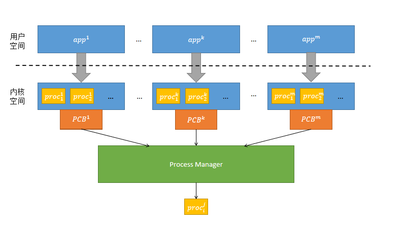

# 需求分析  

实现基于RISCV体系架构，可运行于k210开发板的操作系统内核，并提供一些可供使用的系统调用。截至目前，toyos已实现操作系统的部分关键特性，支持多核进程管理、内存管理以及文件系统等基础功能，并相应实现了一些系统调用，在基于k210处理器的Sipeed M1开发板和qemu上能够成功运行。  
初步实现的系统调用包括：  


 |系统调用|功能说明|
 | ----  | ----  |
 | SYS_GETCWD: usize = 17 | 获取当前工作目录 |
 | SYS_PIPE2: usize = 59 | 创建管道 | 
 | SYS_DUP: usize = 23 | 复制文件描述符 | 
 | SYS_CHDIR: usize = 49 | 切换工作目录 | 
 | SYS_DUP3: usize = 24 | 复制文件描述符，并指定新的文件描述符 | 
 | SYS_chdir: usize = 49 | 切换工作目录 | 
 | SYS_OPENAT: usize = 56 | 打开或创建一个文件 | 
 | SYS_CLOSE: usize = 57 | 关闭一个文件描述符 | 
 | SYS_GETDENTS64: usize = 61 | 获取目录条目 | 
 | SYS_READ: usize = 63 | 从一个文件描述符中读取 | 
 | SYS_WRITE: usize = 64 | 从一个文件描述符写入 | 
 | SYS_LINKAT: usize = 37 | 创建文件的链接 | 
 | SYS_UNLINKAT: usize = 35 | 移除制定文件的链接（可用于删除文件） | 
 | SYS_MKDIRAT: usize = 34 | 创建目录 | 
 | SYS_UMOUNT2: usize = 39 | 卸载文件系统 | 
 | SYS_MOUNT: usize = 40 | 挂载文件系统 | 
 | SYS_FSTAT: usize = 80 | 获取文件状态 | 
 | SYS_CLONE: usize = 220 | 创建一个子进程 | 
 | SYS_EXECVE: usize = 221 | 执行一个指定的程序 | 
 | SYS_WAIT4: usize = 260 | 等待进程改变状态 | 
 | SYS_EXIT: usize = 93 | 触发进程终止，无返回值 | 
 | SYS_GETPPID : usize = 173 | 获取父进程ID | 
 | SYS_GETPID : usize = 172 | 获取进程ID | 
 | SYS_BRK: usize = 214 | 修改数据段的大小 | 
 | SYS_MUNMAP: usize = 215 | 将文件或设备取消映射到内存中 | 
 | SYS_MMAP: usize = 222 | 将文件或设备映射到内存中 | 
 | SYS_TIMES: usize = 153 | 获取进程时间 | 
 | SYS_UNAME: usize = 160 | 打印系统信息 | 
 | SYS_SCHED_YIELD: usize = 124 | 让出调度器 | 
 | SYS_GET_TIMEOFDAY:usize = 169 | 获取时间 | 
 | SYS_NANOSLEEP: usize = 101 | 执行线程睡眠，sleep()库函数都基于此系统调用  | 


# 系统设计

## 系统整体架构设计  

  

toyos遵循模块化设计的思想，将操作系统的构建根据RISC-V架构的特权级分为了三个层级：机器层, 操作系统层以及用户层。对应的程序执行权限也从高到低分布。
- 用户层运行于用户模式，位于虚拟地址空间，通过系统调用接口与内核进行交互；当用户需要进行系统调用时，需要通过ecall陷入内核。为了方便用户与内核的交互，在用户层往往还会对系统调用进行进一步的封装和部分预处理，形成用户标准库Lib。对于不同的语言，可以拥有不同的标准库。
- 操作系统层运行于监管者模式，同样位于虚拟地址空间，通过采用恒等映射的方式对物理内存进行管理。能够管理部分特殊寄存器。在toyos中采用了双核设计，对两个核心进行了封装。两个核心在同一时刻分别运行不同的进程，但与同一个内核进行交互，运行同样的内存管理、进程管理以及文件系统管理。
    - 内存管理主要负责管理用户的虚拟地址空间与物理内存空间的映射关系，包括物理页的分配与回收、虚实页面转换、堆栈的分配等。
    - 进程模块负责进程的资源管理，对进程进行调度等。
    - 文件系统采用FAT32结构，主要对磁盘进行读取和修改，并将读取的数据抽象化为文件，方便内核管理。 
    
    
  
  内核作为中间层，向上需要给用户层提供用户服务抽象，通过中断服务机制给上层提供系统调用接口；向下满足机器层的标准，通过SBI封装的接口与硬件交互。  
- SBI运行于机器模式，封装硬件功能，为操作系统层提供一个抽象化的接口，使得操作系统可以无需过多关心硬件的细节部分，具有更好的兼容性和逻辑性。

## 系统框架
- 进程模块
  - 进程号的分配与回收，进程号决定内核栈的位置
  - 处理器核心的上下文管理
  - 进程上下文管理
  - 进程资源管理
  - 进程调度管理
- 内存模块
  - 内核的动态内存分配
  - 内存管理器，负责管理进程的虚拟地址空间
  - 页表机制实现，包括虚实地址转换、页表项读取、映射以及权限控制等功能。 
  - 物理页帧管理，负责页帧的分配与回收
  - 用于多线程时的内核栈分配，目前暂未使用
- 文件系统模块
  - 磁盘块缓存实现
  - IO设备管理
  - FAT32磁盘数据结构组织、封装和操作
  - 文件系统管理
  - 内核抽象文件系统的实现与管理
  - 并发访问与控制

# 子模块设计
## 进程管理

​		在进程管理部分，需要考虑进程的创建与初始化，维护进程的父子关系，进程的切换，进程资源的分配与回收等问题。一个进程急需要考虑在用户空间上的执行，也需要考虑在内核空间的执行，这也增加了其实现的复杂性。在我们的设计过程中，所有进程之间可以形成一个树结构，树的根节点为一个初始进程,其余进程均在其基础上进行创建。对于进程的管理，其实质上是如何有效维护该进程树。为了实现一个良好的抽象和对进程树的管理，我们将其分成了三个模块，分别是进程控制模块，进程调度模块，进程切换模块。


### 调用关系

​		一个进程的执行过程可以分为两个部分，一部分是在用户空间中执行，另一部分时在内核空间中执行，后者对于前者是透明的，分时多任务系统中，可以让每一个进行感觉自己在连续执行，占用所有的系统资源和时间。在我们的实现中，进程执行的调用关系如下图：



​		每一个执行的应用程序，在内核空间会被分成不同的任务块，当一个应用的所有任务块被执行完毕，该应用程序方算执行完毕，同时这些任务块会在PCB控制块中存储自身的信息。不同的应用程序中的任务块由统一的进程管理器进行管理，由其确定在不同时刻应该由哪一个任务块进行执行，当一个任务块执行完毕或者由于异常退出时，也会分配给下一个任务块进行执行。

### 模块说明

- **进程控制模块**  

主要功能是维护该进程的信息以便对进程进行控制，是用于进程管理的核心模块。这些信息包括进程标识，进程状态，地址空间信息，以及父子进程等。这些信息代表着一个进程中的核心属性，当进程的状态发生改变，相应的便是维护对应进程的控制属性内容，因此要保证不同的进程之间在满足区分的条件之下，又能通过以上的属性进行功能的实现。

- **进程调度模块**  

​		就是以某一种调度策略对当前在进程队列中的全部进程进行管理。用于管理的工具可称之为调度器，其主要的提供的功能便是从队列中取出一个任务以及添加一个新任务。其中可以维护内存中的一组进程队列。当有新的进程被创建，则应该往队列中添加新进程的属性信息，如果进程结束，或者异常退出，则应该会导致该进程中的内容，从队列中删除。但当其他涉及任务调度时，则任务应该始终在队列中。

- **进程切换模块**  

​	用于保存当前执行进程的控制块信息，以及控制流的任务上下文。其主要功能是可以获取当前执行进程的信息以及根据调度结果切换不同的进程。其核心作用可以用于获取当前正在被处理器执行的进程，而当任务被切换，也可通过当前进程控制流的上下文进行进程的切换。因此会与进程调度模块密切相关，当有进程被调度时，代表着应该进行进程的切换，因此需要进程控制器的分配和不同上下文的切换。

## 内存管理
内存管理主要包括内核空间管理、用户空间管理以及页表地址转换三部分，内存空间的管理在内核虚拟地址空间完成。内核空间通过以页为单位恒等映射物理地址空间，对物理地址空间进行管理，用户空间和内核空间在物理内存的分配以及页表地址的转换均在内核空间完成。同时在内核空间还负责管理用户和内核在物理内存的页帧分配与回收、虚拟地址到物理地址的页表映射、用户栈的分配、文件和设备映射以及程序运行中的动态内存分配等。
当前内核地址空间和用户地址空间的布局情况以及它们与物理地址的映射关系如下图所示：  

  

内核地址空间采用恒等映射和随机映射相结合的方式，在`0x8000000~0x80800000`地址段采用恒等映射，使内核常驻内存，同时方便对物理内存的管理，`MMIO`部分同样采用恒等映射。在`0x80800000`以上地址采用随机映射，主要用于跳板页面以及每个进程的内核栈的分配。内核的堆空间作为未初始化的全局变量划分在.bss段中。用户地址空间采用随机映射的方式。
  
### 模块概述：
- **内存管理器模块**  
   
地址空间是一系列有关联的不一定连续的逻辑段，这种关联一般是指这些逻辑段组成的虚拟内存空间与一个运行的程序绑定，即这个运行的程序对代码和数据的直接访问范围限制在它关联的虚拟地址空间之内，每个进程都有自己的内存空间。内存管理器主要便负责管理每个进程的整个虚拟地址空间。包括对地址空间的段的管理、页表管理等。  
  
- **多级页表管理模块**  
  
SV39 多级页表以节点为单位进行管理。每个节点恰好存储在一个物理页帧中，它的位置可以用一个物理页号来表示。每个应用都对应一个不同的多级页表。页表管理器主要负责管理进程多级页表的映射、页表项的管理以及页面的查找等。  
  
- **逻辑段管理模块**  
  
我们用逻辑段为单位描述一段连续地址的虚拟内存。一个内存管理器中包含数个段空间管理器。段空间管理器主要负责段内页面的映射、段内数据管理、段的映射方式以及段的虚拟地址范围确认和修改等。  
  
- **物理页帧管理模块**  
  
当bootloader把内核加载到物理内存中后，物理内存上已经有一部分用于放置内核的代码和数据。我们需要将剩下的空闲内存以单个物理页帧为单位管理起来，当需要存放应用数据或扩展应用的多级页表时分配空闲的物理页帧，并在应用出错或退出的时候回收应用占有的所有物理页帧。  
    
- **内存动态分配模块**  
  
我们在内核的.bss段划分了一段空间用于内核的动态内存分配，通过堆大小的设置、堆分配出错时的处理等对堆进行初始化后，便可利用alloc库对堆空间进行管理  
   
   
K210平台中物理内存最大为8MB，这意味着在高负荷的情况下很容易出现内存不足的情况。针对这点，我们设想了几种方式预防物理内存不足的问题：

- 采用`Copy On Write`写时复制机制；一般情况下，通过`fork`形成的子进程在后续的程序运行中大部分页面并不需要修改，采用页帧共享，延时机制能很好的节省本就紧缺的内存资源，同时也减少了内存访问所带来的CPU周期的消耗以及对`CPU cache`的破坏。
  
- 采用页面换入换出机制；`Copy On Write`对于某些情况下如一个程序多个进程的模式等有很好的效果，但如果同时运行的程序过多，程序过大，写时复制并不能很好的发挥效果。我们可以在外存中设置一个缓冲文件，专门用于存储程序的换出页面并保存每个换出页面的虚拟地址等信息，需要时再调入内存。
  
- 采用`Lazy Alloc`机制；每一个进程所需的堆栈空间并不相同，提前设定空间大小容易造成空间浪费或空间不足的情况，而完全让用户程序来决定分配多少堆栈空间又有内存虚占甚至是恶意攻击的风险。通过用户预设大小，内核实时分配的机制能够很好的解决这些问题。  

针对后期可能的内存占用过大的问题，我们设想了几种解决方案：  

- 程序部分加载机制；在内存占用过大时，物理页帧过少，可能造成无法加载新程序到内存中的问题，为了让程序能够运行，可以只预先加载部分页面到内存中，通过缺页中断机制调用外存页面完成剩余页面的补全。这种机制可以在内存中同时运行更多程序，但容易造成卡顿等问题。  
  
- 程序换出机制；在内存压力过大时，为了及时加载新的程序，可以考虑标记某些内存中的进程并将其换出内存，放入外部缓存中，在内存压力减小时再换回内存中。

由于时间有限，目前我们只实现了`Copy on Write`和堆空间的`Lazy Alloc`机制。

## 文件系统
基于 rCore-Tutorial-Book-v3 教程的松耦合模块化设计思路，我们实现了一个FAT32文件系统，这样的开发过程更易于理解，且具有更好的可拓展性。一方面我们采用抽象接口BlockDevice与底层设备驱动进行连接，避免了与设备驱动的绑定，另一方面通过Rust提供的alloccrate对操作系统内核的内存管理进行了隔离，避免了直接调用内存管理的内核函数。为了避免访问外设中断的相关内核函数，在底层驱动上又采用了轮询的方式来访问虚拟磁盘设备。因此，我们的磁盘文件系统与内核虚拟文件系统分隔开的。除此之外，在我们的文件系统中，任何具备读写功能的系统对象都被视为抽象的文件，对并发访问我们也做了相应的设计从而满足双核系统的需求。
### 文件系统整体结构 
文件系统采用了层次化和模块化的结构设计，磁盘文件系统从下到上主要分为磁盘块设备接口层、块缓存层、磁盘数据结构层、文件系统管理层、虚拟文件系统层。
|层级	| 描述 |
| ---- | ---- |
| 磁盘块设备接口层 |	声明了一个块设备的抽象接口 BlockDevice，实现两个抽象方法read_block和write_block，这两个方法由文件系统的实际使用者提供。|
| 块缓存层 | 提供一个get_block_cache接口来访问块，会根据需求自动读取、写回或替换块。|
| 磁盘数据结构层 |	实现了引导扇区，扩展引导扇区，文件系统信息扇区和长短目录项等核心数据结构，以及抽象的FAT。 |
| 文件系统管理层 |	对磁盘布局的一种抽象。可以打开已有的FAT32文件系统，控制簇的分配与回收。 |
| 虚拟文件系统层 |	为内核提供了文件操作的接口，比如文件的创建、读写、清空来向上支持相关的系统调用。 |

### 文件系统各层级介绍
#### 磁盘块设备接口层
为了在虚拟机和开发板上运行，文件系统必须支持不同的块设备。块设备接口层即用于与不同的块设备对接，同时为文件系统屏蔽不同块设备的差异性，定义了一个以块大小为单位对磁盘块设备进行读写的trait接口。
#### 块缓存层 
I/O设备的读写是影响文件系统性能的关键。为了提升性能，需要利用局部性原理设计缓存以减小I/O设备读写次数。此外，为了避免不同类型的块数据覆盖而造成效率下降，我们设计了双路缓存，分别存储文件数据和检索信息。使用磁盘缓存的另一个好处是可以屏蔽具体的块读写细节，以此提升效率。在我们的设计中，上层模块可以直接向缓存索取需要的块，具体的读写、替换过程交由缓存完成。
#### 磁盘数据结构层 
本层真正开始对文件系统进行组织。FAT32有许多重要的磁盘数据结构，例如引导扇区、扩展引导扇区、文件系统信息扇区、FAT目录项等。他们由不同的字段构成，存储文件系统的信息，部分字段也存在特定的取值。磁盘布局层的工作就是组织这些数据结构，并为上层提供便捷的接口以获取或修改信息。
#### 文件系统管理层 
文件系统管理器层是整个文件系统的核心，其负责文件系统的启动、整体结构的组织、重要信息的维护、簇的分配与回收，以及一些的实用的计算工具。该层为其他模块提供了FAT32相关的实用接口，其他模块如有任何相关的计算或者处理工作。
#### 磁盘虚拟文件系统层 
虚拟文件系统层主要负责为内核提供接口，屏蔽文件系统的内部细节，首要任务就是实现复杂的功能。在该层中，我们定义了虚拟文件结构体以对文件进行描述，其与短目录项成对应关系，共同作为访问文件的入口。该层实现了文件系统常见的功能，例如创建、读写、查找、删除等。
#### 内核虚拟文件系统 
统筹了所有类型的文件，把不同可读写对象抽象出了统一的接口，主要面向系统调用。通过这些接口，相关系统调用可以按一致的编程模式实现，既能提高代码复用率，又具备很强的可扩展性。 
#### 设备管理
在操作系统中，I/O设备管理无处不在，由于各种I/O设备的存在才使得计算机的强大功能。设备管理是内核与设备驱动之间的桥梁，各种I/O设备的高效管理是对一个优秀计算机系统操作系统的考验。对于内核，其需要提供接口使得驱动获取来自用户的控制信息；对于驱动，其需要提供接口以便内核控制和调度。目前来讲，我们的系统仅支持SD Card块设备。

# 系统实现
## 进程管理

### 核心进程模块

#### 进程控制模块

```Rust
pub struct TaskControlBlock {
    pub pid: PidHandle,
    pub kernel_stack: KernelStack,
    inner: UPSafeCell<TaskControlBlockInner>,
}

pub struct TaskControlBlockInner {
    pub status: TaskStatus,
    pub task_cx: TaskContext,
    pub trap_cx_ppn: usize,
    pub memory_manager: MemoryManager,
    pub base_addr: usize,
    pub hartid: isize,
    pub current_path: String,
    //维护父指针
    pub parent: Option<Weak<TaskControlBlock>>,
    pub children: Vec<Arc<TaskControlBlock>>,
    pub fd_table: Vec<Option<FileDescripter>>,
    pub heap_start: usize,
    pub heap_ptr: usize,
    pub last_time: usize,
    pub utime: usize,
    pub stime: usize,
    pub exit_code: i32,
}
```

- **进程标识：**

​		是全局唯一的标识，用以区分不同的进程。在一个进程被创建时，会分配给其一个唯一固定的进程号，其他进程也是通过该进程号从而区分对应进程为哪一个。这也使得在进程管理过程中，我们对于每一个进程的管理不再需要存储该进程全部的信息，只需要根据其进程号便可通过索引获取所需进行的信息。为了实现进程号分配，我们使用了栈式管理方式，当一个进程被回收时，会将其pid号放置在栈顶，如果要分配一个pid号给一个新的进程，则首先从该栈中拿出栈顶元素，如果栈为空，则新创建一个pid号，然后再分配给该进程。

```Rust
struct PidAllocator {
    current: usize,//用于标识当前最大的可分配的pid号
    recycled: Vec<usize>,//用于保存回收到的pid号
}
```

- **进程状态信息：**

​		在进程管理需要根据不同的进程状态而实施不同的管理策略。如果进程处于僵尸状态,此时应该回收其资源；如果进程处于运行状态，则应让其掌握资源正常运行；如果进程处于准备状态，则应将其置于调度队列中，由进程调度器决定其什么时候执行。

- **地址空间信息：**

​		由于进程可能既需要在用户空间中运行，也需要在内核空间中运行，因此就会涉及到地址空间的替换，这些内存信息（包括内核栈地址和用户栈地址，我们并不需要直接保存该地址，只需要通过一种间接的方式找到该地址即可），需要其进行维持，否则当前进程可能在一个错误的地址执行，导致出错。除此之外，由于涉及到不同进程之间的切换，因此进程的上下文内容也值得保存。

- **父子进程信息：**

​		进程中一个很重要的概念便是父子进程，除了根进程无父进程外，每一个进程都拥有唯一的父进程和若干个子进程，所有的这些进程形成了一个进程树。当一个父进程被回收而其子进程还在执行时，此时不能直接回收子进程资源，而是通过将子进程重新挂载到根进程下，即修改子进程的父指针，由根进程决定如何对子进程进行处理。


#### 进程调度模块

```Rust
pub struct TaskManager{
    ready_queue:VecDeque<Arc<TaskControlBlock>>,
}
```

​		在我们的实现中，采用的时FIFO策略管理所有任务，如果一个新的进程被创建，就会将其添加到队列末尾；如果一个进程需要被切换，则将其从队列头删除而添加到队列尾；如果一个进程执行完毕，则直接从队列中删除，其后回收其所占据的资源。值得注意的是，该调度器应该是全局可见的，因为我们对该系统中的所有进程采用统一的策略进程调度，这样我们就可以不用考虑将进程如何分配，其他模块需要根据调度的结果，再进行自身的操作即可。


#### 进程切换模块

```Rust
pub struct Processor{
    current:Option<Arc<TaskControlBlock>>,
    idle_task_cx:TaskContext,//表示idle 控制流的任务上下文
}
```

​		分时多任务操作系统进程管理的一个核心便是如何处理不同进程之间的切换。这个过程其实会涉及到进程的调度和进程的分配，我们这里做了一个解耦合，再进程调度模块中，只进行任务的添加和删除，而在进程分配（或者实际切换）过程中，只根据调度的结果进行两个任务的切换，这样即使是在多核处理器上，我们也不需要修改对应的任务调度模块，只需要按照某种方式，将获取得到的任务切换到需要的处理器上执行即可。在这里进程切换模块需要维持当前正在运行的进行的信息，和任务上下文，当需要切换时，则直接将两者保存在内核栈中，当以后该进程重新被调度执行，可以从中恢复信息。


### 主要调用实现

**1.fork系统调用**

```Rust
pub fn fork()->isize
```

功能：在当前进程中创建一个子进程，对于子进程返回 0，对于当前进程则返回子进程的 PID

简单来讲，便是让子进程复制父进程地址空间中的全部信息。由于会新创建一个子进程，因此需要给这个子进程分配一个新的pid号，除此之外，还需要将该子进程放置到任务队列中用于任务调度。对于发起调用的程序来说，通过区分返回值，从而可以确定是父进程还是子进程。同时对于父进程而言，其控制块需要添加一个新的子节点，对于子进程而言，需要设置父指针为当前进程节点。

**2.exec系统调用**

```Rust
pub fn exec(path:&str)->isize
```

功能：将一个新的进程空间替换当前进程空间进行执行，使得新进程得以执行。

将新的进程空间替换当前进程空间，这意味着该新进程已经在任务队列中了，会需要将用户栈上下文已经内核栈上下文均替换为该新的进程即可。

**3.exit系统调用**

```Rust
pub fn exit(exit_code: i32) -> isize 
```

功能：触发进程终止，并实现进程切换

进程执行过程中，可能会出现多种错误，比如说页面访问缺失出错，非法指令出错等，遇到这种情况时，进程应该立即退出，切换另外的进程执行，并将退出码保存在exit_code中，如果正常退出，则退出码为0。执行该调用时，会将当前进程标识为僵尸状态，如果其下还包含子进程的话，就需要将这些子进程挂载到根进程下，并进行资源的前期回收，因为可能还有其他进程需要访问该父进程，因此不能直接将该进程的资源全都回收，而是交给根进程进行判断。

**4.getpid、getppid系统调用**

```Rust
// 功能：获取进程PID；
pub fn getpid() -> isize 
// 功能：获取父进程PID；
pub fn getppid()->isize
```

功能：getpid用于获取当前正在执行的进程的pid号，getppid则用于获取当前正在执行的父进程的pid号

这两个的实现相对比较简单，因为我们始终能获取当前正在执行的进程的控制块内容，从其中便可以直接获取得到相应的进程pid号(无论时父进程还是子进程)，其实本应该涉及获取父进程pid号中，需要考虑进程是否有父进程这一点，具体来说，针对根进程没有父进程的情况需要做特别的判断，不过因为根进程是由操作系统自己创建的，而不是使用者创建，因此对于使用者创建的每一个进程，均可以认为其具有父进程，因此实际上可以统一处理了。


## 内存管理

### 内核与用户地址空间实现
内核与用户地址空间均开启了SV39页表映射，为虚拟地址空间。每个地址空间由`MemoryManager`进行管理。

#### 内核地址空间

内核地址空间分为恒等映射和随机映射两部分。当RustSBI初始化系统硬件后，内核需要完成操作系统的初始化操作，在运行期间，内核需要维护系统的正常运转，包括中断处理、物理页面分配等。在`0x80200000`到`0x80800000`为RAM物理内存地址，采用恒等映射，载入内核数据，同时管理物理内存；  


内核作为用户与硬件的桥梁，内核地址空间需要提供与硬件交互的接口；在`0x80000000`地址以下为MMIO地址，同样采用恒等映射以对相关设备驱动进行操作；  

在`0x80800000`地址往上为随机映射地址，被划分为了多个进程各自所对应的内核栈空间，同时用安全页隔离开来。
#### 用户地址空间
用户地址空间的最顶层为`TRAMPOLINE`跳板，因为不同的进程地址空间不同，`TRAMPOLINE`保证了切换`satp`寄存器前后指令的连续性，用于地址空间切换，将虚拟地址和物理地址联系起来。这一页面主要是关于进程切换时CPU快照的保存和加载指令。  


`TrapContext`页面位于用户地址空间，保存着各自进程的CPU快照。在陷入内核，切换当前页表为内核页表之前，首先需要保存进程的`TrapContext`到用户地址空间中；在需要返回用户空间时，首先切换`satp`为用户页表，在进入用户地址空间后读取之前的`TrapContext`,实现CPU状态的切换。  

`UserStack`是进程的用户栈空间，由高地址向低地址增长，主要用于函数相互调用时的参数传递，每个进程预先分配一定空间。 

`VMA`用于映射文件和设备，让用户得以对文件进行操作。在用户调用`sys_mmap`指令时，如果未指定地址，则会在这一部分寻找一定的空闲空间用于映射文件设备。由于`VMA`的映射与堆栈的映射方式不同，堆栈为增长式的地址范围，而`VMA`为选择式的段落地址范围，将`VMA`放置在堆栈中间不利于堆栈的动态增长，堆栈有溢出的风险。在后续我们计划将VMA地址与`UserStack`地址互调，以满足堆栈的灵活增长需求。  

`Heap`是进程的堆空间，由低地址向高地址增长，是动态的内存空间。堆空间初始大小为0，随着堆指针的增长而增长。堆指针由进程维护，用户通过调用`sys_brk`实现对堆空间大小的调整。  

### 内存管理器实现
每个进程都有自己的虚拟地址空间，而每一个虚拟地址空间都有一个`MemoryManager`进行管理，每次建立一个新的进程，都会创建一个新的`MemoryManager`用于进程虚拟地址空间的管理。
```rust
/*
 * 内存管理器
 * 每个应用的内存管理
 * page_table存储应用的页表、sections存储应用的各个部分的信息
 * vma用于文件映射
 */
pub struct MemoryManager{
    page_table: PageTable,
    sections: Vec<Map_Section>,
    vma: Vec<Arc<Mutex<Map_Section>>>,//fd, map_section
}
```
`MemoryManager`读取待运行的二进制文件到内存中，通过页表映射将物理内存中的数据映射到虚拟地址空间，并拆分为一个个段，每个段都由各自的`Map_Section`进行管理。`vma`用于管理进程的文件设备的映射空间,`section`管理其他段。在目前的内存管理机制中，文件设备与其他数据段同作为内存数据进行管理，文件的标识符被转换为段标志。

```rust
/*对段的管理*/
pub struct Map_Section{
    content: Content,//段类型
    vpn_start: usize,
    vpn_end: usize,
    data_frames: BTreeMap<usize, Phy_PageFrame>,//每个已分配页面
    map_type: MapType,
    flag: SectionBit,
    writable: bool,
}
```
`Map_Section`管理用户地址空间的一个段，包括段的扩张缩减，段内页面的映射，已映射页面的管理等。每个`Map_Section`由一段连续的虚拟地址空间组成，拥有自己的标志位和映射方式。`vpn_start`与`vpn_end`表示段在虚拟地址空间的页面范围，`data_frames`存储了每个已分配页面的虚拟页帧到物理页帧的映射，同时也间接维护着物理页帧的计数。每当一个`Phy_PageFrame`页帧从`data_frames`弹出删除，那么对应的物理页帧值会自动减一。  

### 页帧管理实现
物理页帧的分配与释放由一个全局管理器`FRAME_MANAGER`进行管理，页帧管理器的数据结构如下：
```rust
/*
 * =========页帧管理==========
 * left、right指明当前未被分配的页帧范围
 * recycle为回收的页帧
 */
pub struct Frame_Manager{
    left: usize,
    right: usize,
    recycle: Vec<usize>,
    reftime: BTreeMap<usize, u8>,
}
```
`Frame_Manager`位于内核地址空间，由于内核对物理内存采用了恒等映射，`Frame_Manager`对所有物理页面统一管理。为了实现`Copy On Write`等的页帧共享机制，`reftime`采用`BTreeMap`数据结构，记录了被共享的物理页号所对应的映射次数。共享物理页面时会相应增加该物理页号的映射次数。每个物理页号被映射时会首先封装为`Phy_PageFrame`，并实现drop机制以实现自动回收。  

```rust
/*
 * 页帧的简单封装
 * ppn为物理页号
 */
pub struct Phy_PageFrame{
   pub ppn: usize,
}
impl Drop for Phy_PageFrame{
    fn drop(&mut self) {
        frame_dealloc(self.ppn);//超出生命周期时调用内核的FRAME_MANAGER进行物理页的回收
    }
}
```

当`Phy_PageFrame`被`drop`时，如果当前页帧被多个进程共享，页帧管理器会自动减少物理页面的映射次数，映射次数为0时，物理页号被推回recycle中成为空闲页面。  

### Copy On Write机制
在正常情况下，每个进程都有自己的虚拟地址空间，每个虚拟地址空间映射互不相交的物理页面。在用户执行`fork`系统调用时，传统的方法是复制父进程所有的物理页面数据到新的物理页面中，并映射到子进程的虚拟地址空间。在这种情况下，子进程在被`fork`后，是父进程的完整的页面副本。这种方案一是没有很好的利用起父子进程的相似性的特点，在很多情况下，子进程并不需要改动父进程的每一个页面，完整的复制整个进程很容易造成物理内存浪费，尤其是面对K210开发板只有8MB内存的情况，多次的副本拷贝很容易形成内存空间不足的问题。二是，进程在调用`fork`后往往伴随着`exec`系统调用，`exec`会覆盖原先的数据，载入新的应用程序elf文件，这种情况下，`fork`时对于父进程的数据拷贝没有任何必要，白白浪费了很多CPU周期。  

`Copy on Write`机制采用复制页帧、页面共享的策略，将子进程的虚拟地址空间映射到父进程所对应的物理页面上，计数被共享的物理页面，同时将物理页面标记为可读。此时父子进程只读共享一个物理页。  

  
  

这时无论父子进程均不可写入页面，当某一个进程需要写入页面数据时，由于页面只读，会产生缺页中断。内核检查页面对应的段标志位，如果可写且对应的物理页帧被映射次数大于1，则为进程分配新的物理页帧并复制数据；如果物理页帧被映射次数为1，则直接将页面标志位改为可写。
```rust

fn dealloc(&mut self, ppn: usize){
    //页帧的回收
    //println!("phyframe dealloc..");
    if self.left <= ppn || self.recycle.iter().find(|&v| {(*v) == ppn})
        .is_some(){
            panic!("memory/phyframe.rs: PageFrame {} has not been allocated!", ppn);
        }
    if self.reftime.contains_key(&ppn){
        *self.reftime.get_mut(&ppn).unwrap() -= 1;
        if(*self.reftime.get(&ppn).unwrap() == 0){
            self.reftime.remove(&ppn);
            self.recycle.push(ppn);
        }
    }
}
```
物理页帧`Phy_PageFrame`实现了`drop`机制，当物理页帧`Phy_PageFrame`从段管理器`Map_Section`中的`data_frames`弹出后，函数返回时自动调用`Phy_PageFrame`的`drop`进行回收，在`drop`调用的'dealloc'函数中，如果页面被多个进程共享，物理页帧的引用次数会自动递减，当reftime为0时压入空闲页面集。
### Lazy Alloc机制
堆空间的分配有两个难以避免的问题：内核对用户待分配堆空间的不可知以及用户对堆空间分配的不完全可靠。  
1. 内核在装入程序的elf文件时无法预知程序所需占用的堆空间大小，每一个进程对堆空间的需求都不一样，有很多进程甚至并不需要堆空间。这就导致内核对堆空间的预分配缺乏合理性，很难预先设定进程的初始堆空间大小，容易造成空间浪费的问题。  
2. 用户要求的堆空间大小也并不完全可靠。如果完全根据用户的要求进行物理页帧的分配，相当于将内核的页帧管理权限上交给用户，这是很不明智的选择。系统所面向的用户对象是不可知的，因此必须要有足够的鲁棒性。只有用户实际写入数据时，才可分配物理页面。否则，可能会造成内存浪费，系统宕机，甚至会遭受恶意攻击。  

堆空间管理的Lazy Alloc对用户要求的堆空间扩展采用延时分配的机制。每次用户调用`sys_brk`系统调用时，内核并不分配实际物理内存扩充堆空间，而是仅利用堆指针对进程地址空间中的堆进行缩放。此时堆指针的扩展只限于虚拟内存，而不作用到物理内存中，只有当用户实际需要使用到某个虚拟页面的时候再给它分配物理页帧。在最大只有8MB内存的开发板上，这种操作能够很好的节省足够的空间，减轻后期面对强度大的程序时可能出现的内存不足问题。 

  

每个进程都需要维护一个堆指针，当用户调用`sys_brk`系统调用时，brk函数调整进程的堆指针位置，同时对堆段的范围进行调整，但并不映射到物理内存中。用户往未映射的堆空间中写入数据时，会触发缺页中断，内核利用堆指针检查缺页是否属于堆空间，如果落在堆地址范围内，才进行物理页面的分配。  

在用户地址空间中，堆空间是连续的，但是，在内核地址空间中，用户堆的分配不同于内核堆空间管理，用户堆在物理内存空间中与其他的段空间相同，采用离散分配的方式，一个堆空间所映射的每一个物理页帧都可能是分开的，用`Map_Secion`进行管理。
  
## 双核三队列调度机制
Sipeed M1开发板拥有双核处理器，支持同时两个进程的并行处理。恰当的多进程并行能够极大的提高运行速度，一个优秀的内核应该具有多核运行的能力。
### 1. 多核开启的准备
由于多个核心并行运行，并且不同核心所面对的内核进程和用户进程都是共有的，这让我们不得不考虑内存一致性的问题。
#### 内存的一致性
- 多个核心有可能同时陷入内核，虽然每个核心有自己的CPU快照，但多个核心同时对内核全局变量的访问和修改必然造成不一致的问题。因此，对于内核所有的全局变量，包括内核地址空间管理`KERNEL_SPACE`，任务管理器`TASK_MANAGER`等，都需要用锁`Mutex`加以保护。
- 多个核心同时陷入内核，每个核心的进度不同，调用的函数也不相同，因此用于保存内核中函数调用参数的内核栈也需要各自独立。  
- 如果多个核心同时对一个进程进行处理，便容易出现错乱的情况，因此对于每一个进程控制块，内部都需要采取互斥访问操作。
#### 双核三队列机制
在多核CPU中，如果所有核心共用一个任务管理器的调度队列，容易产生以下问题：  

- 每个CPU拥有自己的高速缓存L1，如果共用一个调度队列，意味着每次核心切换进程或线程时都有很大机率遇到完全无关的进程，从而使得这些cache完全失效。由于我们采用`Copy On Write`,对于同一进程的父子进程，在没有执行`exec`时对于物理内存映射，尤其是`.text`这种只读指令段是可以共享的；而且，以当前的操作系统发展，多线程是必不可少的；这意味着在核心进行切换时应该考虑到cache利用的问题。
- 如果多个核心共用一个调度队列，那么便容易频繁产生锁的争抢，这种在系统层的锁争抢会严重影响性能。  
  


为了能够提升多核性能，我们采用了N+1调度队列机制。每个核心各自拥有一个调度队列，其中进程的父子进程都在同一个调度队列中。因为不同的进程运行时间不一致，调度队列的长度也不一样，如果只是双队列形式，那么为了较早完成调度队列的核心继续保持运转，就不得不争抢另一个核心的调度队列中的进程，这会导致频繁的锁争抢问题。因此，我们另外设置了一个备用调度队列，并保证备用调度队列始终不为空，与其他调度队列长度保持一定比例。如此便能在保证cache充分利用的同时缩小锁的争抢频率。当然，为了防止备用队列的进程长期待机，每个核心需要有一定的概率访问备用队列。

### 2. 多核的初始化
副核的初始化需要在主核的初始化完成之后才可以开始。在主核初始化时，副核循环等待，直到确保主核初始化完成。副核的初始化主要分为几步：  

1. 首先，由于每一个核心并行运行，互不限制，核心有可能会同时处于内核层。在内核运行的过程中，函数的调用导致内核会频繁的进行压栈出栈的操作，如果两个核心共用一个内核栈，则内核栈指针必然混乱。因此，开启双核的第一步，便是为每一个核心提供一个的内核栈。  

2. 每个核心在同一时刻运行不同的用户进程，这意味着我们必须为每个核心分别进行管理。每个核心均拥有一个核心管理器，主要负责在进程切换时保存进程的状态。
```rust
pub struct Processor{
    current:Option<Arc<TaskControlBlock>>,
    idle_task_cx:TaskContext,
    //idle_task_cx表示当前处理器上的 idle 控制流的任务上下文，保存run_tasks中的状态，每次schedule利用该上下文回到run_tasks进行再次调度
}
lazy_static!{
    static ref PROCESSOR: [Mutex<Processor>; 2] =
    unsafe {[Mutex::new(Processor::new()), Mutex::new(Processor::new())]};
}
```

3. 在多核处理器中，每个核心均有自己的寄存器，有自己的cache缓存，各个核心之间的如`satp`寄存器、`stvec`寄存器等均不互通，无论是主核还是副核，都有自己的快照。这样以来，在双核处理器中，要让副核开始工作，必须对副核进行初始化。在主核初始化完成后，需要赋值副核的寄存器。副核寄存器的初始化包括：
  -  每个核心虽然共用一个内核页表，但是，不同核心的寄存器无法互相交流，我们要让副核也知道内核根页表的地址。同时，我们也要对副核的TLB进行刷新。
  -  在即将进入用户层时，还需要开启副核的用户中断，告知副核内核的trap地址，这样当用户产生中断时才能正常进入内核。。同时还开启副核的时钟中断等。
  -  设置时钟中断时间。

4. 在完成上述初始化后，副核加载进程，开始运行。


## 文件系统
### 块设备接口层 
块设备接口层定义了块设备驱动需要实现的接口，通过该层，文件系统访问块设备将是透明的。使用Trait声明了一个块设备的抽象接口，其中包含read_block 和write_block两个方法。
```rust
pub trait BlockDevice : Send + Sync + Any {
fn read_block(&self, block_id: usize, buf: &mut [u8]); 
fn write_block(&self, block_id: usize, buf: &[u8]); 
}
```
read_block将相应id的块读入内存缓冲中，write_block则将内存缓冲区中的数据写入对应id的块。对于设备驱动，为了提高开发的效率，我们使用了rCore-Tutorial的SD卡驱动。
### 块缓存层 
文件系统以块为基本读写单位，因此缓存的基本单位也是块。一共使用了20个缓冲块，块缓存的结构如下。
```rust
const BLOCK_CACHE_SIZE: usize = 20;
pub struct BlockCache {
    pub cache: [u8; BLOCK_SZ],
    block_id: usize,
    block_device: Arc<dyn BlockDevice>,
    modified: bool,
    #[allow(unused)]
    time_stamp: usize,
}
```

由于内存有限，系统所定义的缓存块数量仅有20个，如果采用单层缓存设计，在访问大文件时会出现大量缓存块被覆盖的问题，使目录、检索等的操作效率变低，特别是在修改文件时，需要频繁访问FAT和磁盘信息扇区。因此，采用多层缓存设计方法，我们将块缓存分为信息缓存和数据缓存，从而减少覆盖的问题。其中，信息缓存用于缓存存储检索信息的块，如文件系统信息扇区、FAT、目录等；数据缓存则用于缓存存储文件的数据块，信息缓存和数据缓存各使用10个块。使用一个块缓存全局管理器BlockCacheManager来判断要读写的磁盘块是否已经载入内存，如果存在则直接返回，否则将从磁盘载入相应数据到内存，当磁盘块缓冲区数量已满时，采用Clock算法进行缓存替换。
```rust
pub struct BlockCacheManager {
queue: VecDeque<(usize, Arc<RwLock<BlockCache>>)>,
    start_sec: usize,
    limit: usize,
}
```
管理器仅使用一个队列来维护所有缓存块，该队列管理块编号和块缓存的二元组。块编号的类型为usize，而块缓存的类型则是Arc<Mutex<BlockCache>>，其在堆上动态增减，同时提供共享引用和互斥访问。块缓存层结构如下图所示：

  

利用缓存，我们屏蔽了扇区读写的具体细节。通过get_block_cache以及get_info_cache等接口，上层模块不必考虑分区的起始偏移等问题，直接从块缓存管理器中获取一个编号为 block_id的块的块缓存，如果找不到，块缓存管理器就会帮其从磁盘读取到内存。为了让上层模块可以直接按照需要的数据类型对缓存块操作，这些接口支持传入闭包，通过闭包可以指定数据类型和处理的过程，进而对块中指定类型的数据进行操作。
```rust
pub fn get_block_cache(
    block_id: usize, 						//逻辑块号
    block_device: Arc<dyn BlockDevice>, 		//块设备接口
    mode: CacheMode, 					//指定读写模式
) -> Arc<RwLock<BlockCache>> 
pub fn get_info_cache(
    block_id: usize,
    block_device: Arc<dyn BlockDevice>,
    mode: CacheMode,
) -> Arc<RwLock<BlockCache>> 	
```
### 磁盘数据结构层
磁盘数据结构层用于组织FAT32特有的数据结构。
#### 引导扇区和扩展引导扇区
引导扇区储存了块设备的基本信息，包括扇区大小、扇区数量、簇大小、版本、校验签名、保留扇区数目、文件信息扇区所在位置等。如果设备进行了分区，引导扇区还包含了第一个分区的起始扇区。引导扇区的信息负责在文件系统其动时进行校验并为管理层提供相关的信息，也仅在文件系统起动时会读入。这两个扇区的结构体定义如下，所有字段都作为成员，与磁盘数据一一对应。
```rust
//引导扇区结构
pub struct FatBS {
    pub unused: [u8;11],
    pub bytes_per_sector: u16,
    pub sectors_per_cluster: u8,
    pub reserved_sector_count: u16,
    pub table_count: u8,
    pub root_entry_count: u16, //为0
    pub total_sectors_16: u16,
    pub media_type: u8,
    pub table_size_16: u16,
    pub sectors_per_track:u16,
    pub head_side_count: u16,    
    pub hidden_sector_count: u32,  
    pub total_sectors_32: u32,    
}
//扩展引导扇区结构
pub struct FatExtBS{
    table_size_32:u32,
    extended_flags:u16,   
    fat_version:u16,
    root_clusters:u32,   
    fat_info:u16,
    backup_bs_sector:u16,
    reserved_0:[u8;12],
    drive_number:u8,
    reserved_1:u8,
    boot_signature:u8,  
}
```
#### 文件系统信息扇区
文件系统信息扇区共有五个重要字段：前两个字段为校验签名， 第三个为FS剩余簇数、第四个字段为起始空闲簇、第五个字段为校验签名。该扇区的有效字段分布于扇区首尾，中间均为无效字节。为了节约空间，我们定义了一个FSInfo结构体，其只包含扇区号这一个成员，但是实现了丰富的接口，包括签名校验，簇信息字段的读写。因为扇区的读写经由缓存，而缓存的提供的接口只需要扇区号和偏移信息。
```rust
pub struct FSInfo{
    sector_num: u32,
}
impl FSInfo{
pub fn check_signature(&self, block_device: Arc<dyn BlockDevice>) -> bool 
pub fn read_free_clusters(&self, block_device: Arc<dyn BlockDevice>) -> u32
pub fn write_free_clusters(&self, free_clusters: u32, block_device: Arc<dyn BlockDevice>)
pub fn first_free_cluster(&self, block_device: Arc<dyn BlockDevice>) -> u32
pub fn write_first_free_cluster(&self,start_cluster: u32,block_device: Arc<dyn BlockDevice>)
}
```
#### FAT32目录项
FAT32的目录项长32字节，包括长文件名目录项和短文件名目录项两种类型，当文件名较长时，采用多个长名目录项加一个短名目录项的形式存储。文件的所有信息都存储于短名目录项，包括名称、扩展、属性、创建（访问、修改）时间、大小、起始簇号等，其作为文件的访问入口。对于长短名目录项，我们均设计了丰富的接口以进行封装，这样上层在访问时可以以直观的数据类型读写信息，而不必考虑复杂的内部结构。
```rust
pub struct ShortDirEntry{
    name: [u8;8], // 删除时第0位为0xE5，未使用时为0x00. 有多余可以用0x20填充
    extension: [u8;3],
    attribute: u8,       //可以用于判断是目录还是文件
    winnt_reserved: u8,
    creation_tenths: u8, 
    creation_time: u16,
    creation_date: u16,
    last_acc_date: u16,
    cluster_high: u16,
    modification_time: u16,
    modification_date: u16,
    cluster_low: u16,
    size: u32,
}
pub struct LongDirEntry{
    order: u8,     
name1: [u8;10], 
attribute: u8,  
    type_: u8,
    check_sum: u8,
    name2: [u8;12], 
    start_cluster: [u8;2],
    name3: [u8;4],  
}
```
不论是长短目录项，都有一个attribute字段，有以下的标志可取：
```rust
pub const ATTRIBUTE_READ_ONLY:u8 = 0x01;
pub const ATTRIBUTE_HIDDEN   :u8 = 0x02;
pub const ATTRIBUTE_SYSTEM   :u8 = 0x04;
pub const ATTRIBUTE_VOLUME_ID:u8 = 0x08;
pub const ATTRIBUTE_DIRECTORY:u8 = 0x10;
pub const ATTRIBUTE_ARCHIVE  :u8 = 0x20;
pub const ATTRIBUTE_LFN      :u8 = 0x0F;
```
`LFN=0x0F`，表示目录项为长文件名，其余则用于判断文件、目录和读写权限。
短名目录项的核心接口如下：
|接口名称	| 描述 |
| ----   | ---- |
|initialize	| 以指定的信息初始化目录项|
|data_clusters | 返回目前使用的簇的数量|
|get_pos | 获取文件偏移量所在的簇、扇区和偏移|
|read_at | 在指定偏移处读文件|
|write_at | 在指定偏移处写文件|
|as_bytes | 将数据结构转换为字节数组|
|checksum | 计算校验和|
|get_creation_time | 获取创建时间|
|set_first_cluster | 设置文件起始簇|

短文件名目录项比较简单，其用11个字节存储文件名，包括8字节名称和3字节扩展名，使用ASCII编码。长目录项用26个字节存储文件名，使用Unicode编码。长文件名目录项的第一个字段为order，用于表示使用多个目录项时的顺序。如果order的第五位为1，则为最后一个长名目录项。长文件名的目录项可以由多个目录项拼接而成，以倒序布局于磁盘。为了屏蔽内部的存储细节，我们实现了get_name接口，其以字符串的形式返回目录项中的文件名，便于其他模块使用。
#### FAT(文件分配表)
文件分配表是FAT文件系统管理磁盘空间和文件的最重要区域，它保存逻辑盘数据区各簇使用情况信息，采用位示图法来表示，文件所占用的存储空间及空闲空间的管理都是通过FAT实现的。Fat32共保存了两个相同的FAT，便于第一个损坏时，还有FAT2作为备份可用。FAT表的大小由该逻辑盘数据区共有多少簇所决定，取整数个扇区。数据区中每簇的使用情况通过查找其在FAT表中相应位置的填充值可知晓。FAT32表中每簇占用四个字节（32位）表示，开头8个字节用于存放该盘介质类型编号，有效簇号从02H开始。02H簇的使用情况由08H-0BH字节组成的32位二进制数指示出来，03H簇的使用情况由0CH-0FH字节组成的32位二进制数指示出来。未被分配使用和已回收的簇相应位置写零，坏簇相应位置填入特定值0x0FFFFFF7标识，对于已分配的簇，如果该簇是文件的最后一簇，填入的值为0x0FFFFFF8，如果该簇不是文件的最后一簇，填入的值为该文件占用的下一个簇的簇号，这样，正好将文件占用的各簇构成一个簇链，保存在FAT32表中。
```rust
pub const FREE_CLUSTER:u32 = 0x00000000;
pub const END_CLUSTER:u32  = 0x0FFFFFF8;
pub const BAD_CLUSTER:u32  = 0x0FFFFFF7;
```
在实现上，我们定义了一个FAT结构体，其包含两个成员，分别是FAT1和FAT2的起始扇区号。
```rust
pub struct FAT{
    fat1_sector: u32,	//FAT1的起始扇区
    fat2_sector: u32,	//FAT2的起始扇区
    n_sectors: u32, 	//大小
    n_entry: u32,		//表项数量 
}
```
我们对FAT实现了丰富的接口，核心接口定义如下：
|接口名称	| 描述|
| ----   | ----|
|calculate_pos	| 计算簇对应表项的位置：sector和offset|
|next_free_cluster	| 搜索下一个可用簇|
|get_next_cluster	| 查询当前簇的下一个簇|
|get_cluster_at	| 获取某个文件的指定cluster|
|set_next_cluster	| 设置当前簇的下一个簇|
|final_cluster	| 获取某个簇链的最后一个簇|
|get_all_cluster_of	| 获取某个簇链从指定簇开始的所有簇|
|count_cluster_num	| 获取某个簇链从指定簇开始的所有簇数量|

#### 文件系统管理层 
文件系统管理器负责启动文件系统，其需要读取引导扇区、FSinfo扇区的数据并进行校验，然后对数据结构进行简单组织。文件系统的启动流程如下：  

  

管理器的结构体定义如下：
```rust
pub struct FAT32Manager {
    block_device: Arc<dyn BlockDevice>,  //块设备的引用
    fsinfo: Arc<FSInfo>,			//文件系统信息扇区的引用
    sectors_per_cluster: u32,	//每个簇的扇区数
    bytes_per_sector: u32,		//每个扇区的字节数
    bytes_per_cluster: u32,		//每个簇的字节数
    fat: Arc<RwLock<FAT>>,		//FAT的引用
    root_sec: u32,				//根目录所在簇号
    #[allow(unused)]
    total_sectors: u32, 			//总扇区数
    vroot_dirent:Arc<RwLock<ShortDirEntry>>,//虚拟根目录项
}
```
对于其他模块而言，管理器提供了实用的工具。所有FAT32相关的计算，或者文件系统的相关信息，都可以调用管管理器的接口，包含计算文件起始扇区、拆分长文件名、文件名格式化、短文件名生成、计算文件大小所需簇、获取可用簇、单位转换等。
#### 虚拟文件系统层 
虚拟文件系统层主要负责为内核提供接口，屏蔽文件系统的内部细节，首要任务就是实现复杂的功能。因为将短目录项作为文件的访问接口，在虚拟文件系统中，我们定义了虚拟文件对象vFile结构体，其记录了文件短目录项所在扇区和偏移包含FS管理器和块设备接口的引用，是一个简单的抽象:
```rust
pub struct VFile {
    name:String,
    short_sector: usize, 
    short_offset: usize, 			   //文件短目录项所在扇区和偏移
    long_pos_vec: Vec<(usize, usize)>, // 长目录项的位置<sector, offset>
    attribute:u8,
    fs: Arc<RwLock<FAT32Manager>>,
    block_device: Arc<dyn BlockDevice>,
}
```
本文件系统以短目录项为访问入口，因此此处的虚拟文件与短目录项对应。以下是VFile对内核提供的重要接口：
```rust
    pub fn get_attribute(&self)->u8;
    pub fn get_size(&self)->u32;
    pub fn get_fs(&self) -> Arc<RwLock<FAT32Manager>>;
    pub fn is_dir(&self)->bool;
    pub fn is_short(&self)->bool;
    pub fn read_short_dirent<V>(&self, f: impl FnOnce(&ShortDirEntry) -> V)->V;
    fn modify_long_dirent<V>(&self, index:usize ,f: impl FnOnce(&mut LongDirEntry) -> V)->V;
    pub fn modify_short_dirent<V>(&self, f: impl FnOnce(&mut ShortDirEntry) -> V)->V;
    pub fn get_pos(&self, offset:usize) -> (usize, usize);
    fn find_long_name(&self, name: &str,dir_ent: &ShortDirEntry)->Option<VFile>;
fn find_short_name( &self, name:&str, dir_ent: &ShortDirEntry) -> Option<VFile>;
fn increase_size( &self, new_size:u32,);
 // 根据名称搜索文件 
    pub fn find_vfile_byname(&self,name: &str,) -> Option<VFile>;
    // 根据路径递归搜索文件
    pub fn find_vfile_bypath(&self, path: Vec<&str>)-> Option<Arc<VFile>>;
    // 在当前目录下创建文件
    pub fn create(&self, name: &str, attribute: u8) -> Option<Arc<VFile>>;
    pub fn first_cluster(&self)->u32;
    // 列举当前文件下的所有文件
pub fn ls(&self)-> Option<Vec<(String, u8)>>;
// 在当前文件的指定偏移处读数据
pub fn read_at(&self, offset: usize, buf: &mut [u8])->usize;
// 在当前文件的指定偏移处写数据
pub fn write_at(&self, offset: usize, buf: &mut [u8])->usize;
// 删除当前文件
    pub fn clear(&self);
    // 获取目录中offset处目录项的信息
pub fn dirent_info(&self, off:usize) -> Option<(String, u32, u32, u8);
```
#### 内核抽象文件系统 
在内核中，我们定义了OSInode结构体来表示文件，该结构体包含读写标签、当前偏移、以及对应虚拟文件的引用。
```rust
pub struct OSInode {
    readable: bool,
    writable: bool,
    inner: Mutex<OSInodeInner>,
}
pub struct OSInodeInner {
    offset: usize, 		//当前偏移
    inode: Arc<VFile>, 	// inode引用
}
```
不管是文件还是目录，在内核中都封装为索引节点OSInod的形式。包括实际的文件和可读写的对象，他们都实现了文件的接口File。File包含四个方法：判断可读、可写、读、写。Stdio通过RustSBI的接口控制UART实现，不具备实体文件，因此这样的抽象文件是无法用OSInode描述的。问题在于，每个进程都要使用文件描述符表维护打开的文件。我们定义了一个枚举类FileClass，目前其中包含两种类型，分别是抽象文件和实体文件。抽象文件使用动态分配机制对实现了File接口的任意结构体引用，实体文件则是对OSInode的引用。在文件描述符表中存储FileClass，既能保证维护不同类型的文件，也能保持不同类型文件的方法。
#### 并发访问
为了支持双核，使其能同时访问文件系统。我们通过读写锁的方式来保证并发访问的正确性。当不同核的两个进程同时需要读一个资源，则可以同时访问资源，仅在写资源的时候互斥访问。目前有两类对象需要加锁：FAT和缓存块。对FAT的访问多数为查询，获取读锁即可，仅在对文件增删改的时候可能会修改FAT，因此可以达到较好的并发。但FAT的修改位置是近似为随机的，因为需要修改的表项是动态变化的。无法保证分配或者回收的簇号，也就无法保证表项在哪个数据块，进而在执行单个事务时无法保证原子性。例如分配簇时，可能需要分配多个簇，而这多个簇对应的表项可能位于不同的数据块，因此仅对某个块加锁并不能保证其他块上的表项不被另一进程篡改。为此，需要对FAT整体加锁。缓存块锁是整个文件系统最基础的锁，因为文件系统是以块作为读写单位。块级锁实际上也实现了对整个文件的加锁，因为本文件系统以短名目录项为访问文件的入口，而访问短名目录项需要获得其所在块的锁，因此相当于对整个文件加锁。
